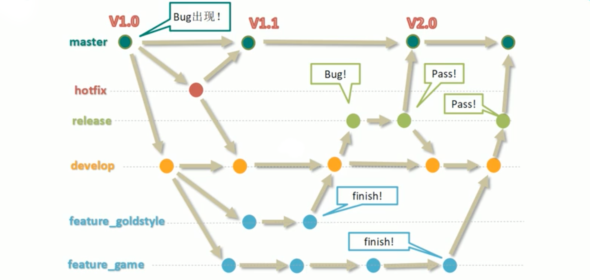

#Plug 'junegunn/gv.vim'## Git [Git学习](https://www.youtube.com/watch?v=Bbtx90WtpAc&list=PLmOn9nNkQxJFISyrvKUk8OWg-Pzs1donX&index=2)

#### 版本控制工具功能
- 协同修改
- 数据备份
- 版本管理
- 权限控制
- 历史记录Plug 'junegunn/gv.vim'
- 分支管理

#### Git和代码托管中心
> 局域网环境下
  - GitLab 服务器

> 外网环境下
  - GitHub
  - 码云

#### 本地库和远程库
- 团队内部协作
- 跨团队协作

> 项目级别/仓库级别：仅在当前本地范围有效
  - git config user.name tom_pro 
  - git config user.mail goodMor_pro@163.com
  - 信息保存的位置：./git/config

> 系统用户级别：登录当前操作系统的用户范围
  - git config --global user.name tom_gb
  - git config --global user.mail goodMor_pro@163.com
  - 信息保存的位置：~/.gitconfig

- git init 初始化本地仓库
- git add 将要提交的文件添加到暂存区
- git rm --cache README.md 撤销添加的README.md文件
- git status 查看暂存区的状态
- git commit -m "commit message" [filename] 提交操作 

- git log 查看历史记录
> 日志多屏显示控制方式
> > - 空格向下翻页
> > - b 向上翻页
> > - q 退出

- git log --online | nl  带有编号的日志
- git log --graph --oneline --decorate  格式单行git log

- git reflog 恢复

> 前进 后退
> > - 基于索引值操作【推荐】 git reset --hard 索引值
> > - 使用^ 只能往后退 git reset --hard HEAD^ 一个^代表后退一步 两个代表两步
> > - 使用~ 只能后退 git reset --hard HEAD~2 代表后退两步

#### reset 命令三个参数对比
> - --sort  仅仅在本地库移动HEAD指针
> - --mixed 在本地库移动HEAD指针、重置暂存区
> - --hard  在本地库移动HEAD指针、重置暂存区、重置工作区

#### 删除文件并找回
- 前提： 删除前文件存在时的状态提交到本地库
- 操作：git reset --hard 指针位置

#### 比较文件差异
- git diff 文件名 （将工作中的文件和暂存区进行比价）
- git diff 本地库中历史版本文件名 （将工作中的文件和本地库历史记录比价）
- 不带文件名比较多个文件

#### 分支
> 分支
- 在版本控制过程中，使用多条线同时推进多个任务
> 分支的好处
> > - 同时进行推进多个功能开发，提高开发效率
> > - 各个分支在开发过程中，如果某一个分支开发失败，不会对其他分支有影响，失败的分支删除重新开始即可。

> 分支操作
> > - 创建分支 git branch 分支名
> > - 查看分支 git branch -v
> > - 切换分支 git checkout
> > - 合并分支 git merge 分支名
> > - 解决冲突 
> > > 1). 编辑文件删除特殊符号
> > > 2). 把文件修改到满意的程度，保存退出
> > > 3). git add 文件名
> > > 4). git commit -m "日志信息" 此时的commit 不能带具体文件名

#### git工作流

### VIM git
- G log 查看提交的日志
- G diff 对比
- G add . 添加要提交的文件
- G commit 提交
- Gsplit HEAD~1:%
- Gdiffsplit

- `vim -d a b`  a和b文件内容对比 使用ctrl+w+J换行
- `vim -O a.html b.html` 同时打开a.html b.html
